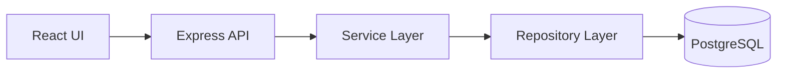

# Architecture Notes

## Product Goal

The HR manager needs a reliable way to manage 10,000 employee records and quickly inspect salary patterns by country and job title.

## Backend Structure

```txt
backend/src
  config/       environment parsing
  db/           Prisma client
  modules/
    employees/ CRUD, validation, repository, service
    insights/  salary analytics endpoints
  seed/         10,000 employee seed script
```

## Key Decisions

- PostgreSQL is used because the assessment is data-centric and salary insights need relational filtering and aggregation.
- Prisma keeps schema, migrations, and type-safe database access together.
- Services contain business behavior and are tested with in-memory repositories.
- Repositories isolate Prisma queries from controller and service code.
- Indexes are added on `country`, `jobTitle`, and `(country, jobTitle)` because those fields drive salary insights.

## API Flow


